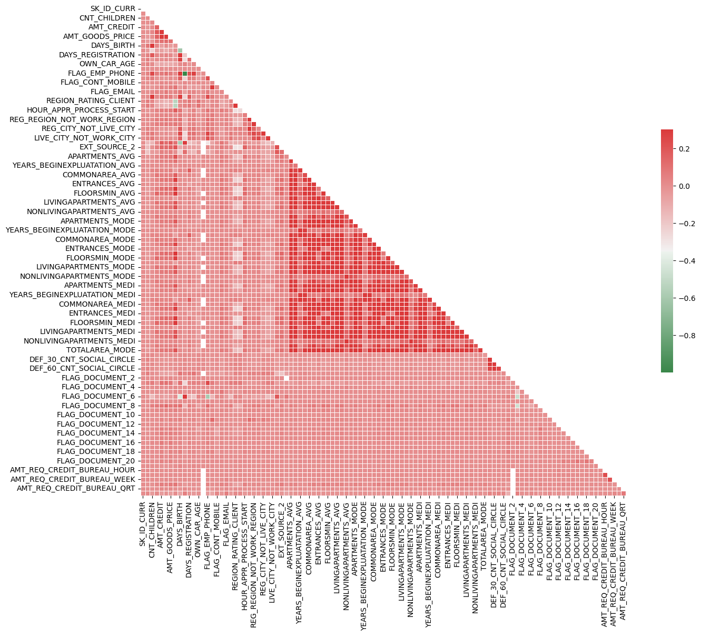
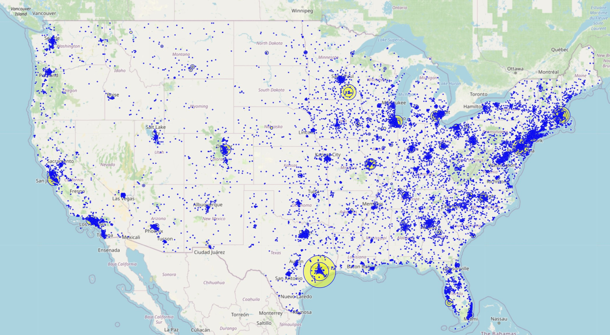

## Portfolio
---

[Loan Risk Assessment from Alternative Financial Indicators](https://github.com/pvstewar/ML_Classification_HCDR)

The topic of this project is using Python Machine Learning to classify credit default risk based on data about individuals that is typically outside of the normal data reported to lenders in attempting to attain credit. The project data and the submissions included were part of the Kaggle [Home Credit Default Risk competition](https://www.kaggle.com/competitions/home-credit-default-risk). The sections of the project are divided into multiple notebooks for ease of access and can be viewed in the following links.

    

- [Part 1 Exploritory Data Analysis](https://github.com/pvstewar/ML_Classification_HCDR/blob/main/P1_HCDR_EDA.ipynb)
- [Part 2 Feature Engineering](https://github.com/pvstewar/ML_Classification_HCDR/blob/main/P2_HCDR_Dataset_Build.ipynb)
- [Part 3 SKLearn Pipeline](https://github.com/pvstewar/ML_Classification_HCDR/blob/main/P3_HCDR_ML_Pipeline.ipynb)
- [Part 4 PyTorch Pipeline](https://github.com/pvstewar/ML_Classification_HCDR/blob/main/P4_HCDR_Pytorch_Pipeline.ipynb)
- [Part 5 Balancing with Smote](https://github.com/pvstewar/ML_Classification_HCDR/blob/main/P5_HCDR_Balance.ipynb)

- [Project Report](https://github.com/pvstewar/ML_Classification_HCDR/blob/main/HCDR_Report.pdf)

   
  

---

[Mapping Food Deserts with Venue Data](https://github.com/pvstewar/Food-Availability-Mapping)

This project was created to explore the concept of "Food Deserts", or areas in a city that have limited access to healthy food sources. This project uses the Four-Square venue application's open data combined with geographic location info. The project was intended to visualize the geographic distribution of grocery stores in the city of Indianapolis, Indiana and map this distribution for easy visualization in a heat map configuration. The project can easily be adapted to map any US location. The project also uses KNN clustering to organize the zip codes around Indianapolis based on this distribution, as well as conducting some basic EDA around connections between income and food availability to help add context to the data.

     

[Project Notebook](https://github.com/pvstewar/Food-Availability-Mapping/blob/master/Grocery%20Store%20Data%20Project.ipynb) 
[Project Report](https://github.com/pvstewar/Food-Availability-Mapping/blob/master/Grocery%20Store%20Availability%20Report.pdf)

---
[Clinical Trial Analysis](https://github.com/pvstewar/IN_Clinical_trials)

The purpose of this project is to gather data about clinical trials that have been conducted in the state of Indiana in order to make a determination about the level of trial activity in the state, how it compares to other states, and the nature of the trials. The goal is to understand where Indiana ranks, what areas we may be able to target to make the state more of a destination for clinic trials in the future, and to get a general sense of the distribution of trial activity across the country as a whole.

    

[Project Notebook](https://drive.google.com/file/d/1p3kx5b70l_JfLGdvxLHIDeHsae1zuaGD/view?usp=sharing)
[Project Slides](https://github.com/pvstewar/IN_Clinical_trials/blob/main/Final%20IN%20Clinical%20Trial%20Report.pdf)

---
[Project 3 Title](http://example.com/)

---

- [Project 1 Title](http://example.com/)
- [Project 2 Title](http://example.com/)
- [Project 3 Title](http://example.com/)
- [Project 4 Title](http://example.com/)
- [Project 5 Title](http://example.com/)

---

---

Page template forked from <a href="https://github.com/evanca/quick-portfolio">evanca</a>

<!-- Remove above link if you don't want to attibute -->
