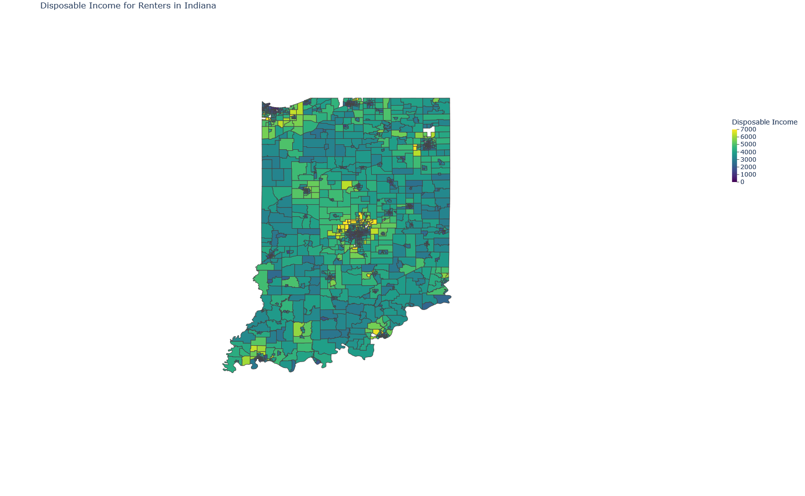
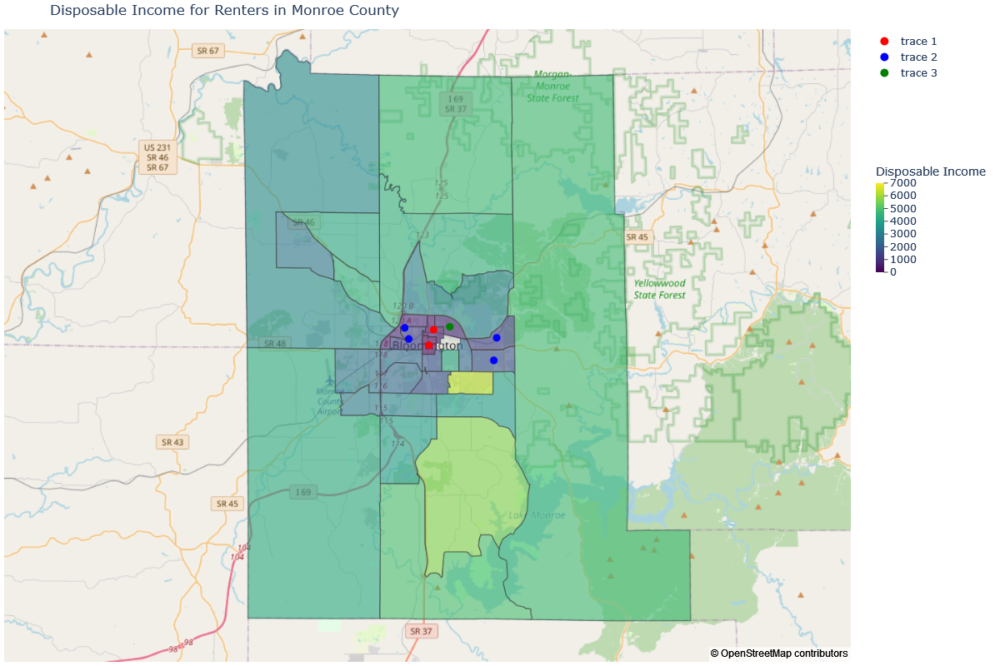

## Portfolio
---
[Clustering and Mapping Food Deserts with Venue Data](https://github.com/pvstewar/Food-Availability-Mapping)

This project was created to explore the concept of "Food Deserts", or areas in a city that have limited access to healthy food sources. This project uses the Four-Square venue application's open data combined with geographic location info. The project was intended to visualize the geographic distribution of grocery stores in the city of Indianapolis, Indiana and map this distribution for easy visualization in a heat map configuration. The project can easily be adapted to map any US location. The project also uses KNN clustering to organize the zip codes around Indianapolis based on this distribution, as well as conducting some basic EDA around connections between income and food availability to help add context to the data.

     

[Project Notebook](https://github.com/pvstewar/Food-Availability-Mapping/blob/master/Grocery%20Store%20Data%20Project.ipynb) 
[Project Report](https://github.com/pvstewar/Food-Availability-Mapping/blob/master/Grocery%20Store%20Availability%20Report.pdf)

---
[Using Data Visualization to Examine ML and Graph Cryptocurrency Illicit Transaction Datasets](https://github.com/pvstewar/ML_Crypto_DataViz)

The purpose of this project was to demonstrate a variety of python data visualization techniques. Given the key role of cryptocurrency in monetizing cybersecurity vulnerability exploitation, I was interested in understanding the methods used in tracking illicit transactions in some of the most common cryptocurrency types. It was challenging to find publicly available quality machine learning and advanced analytics studies that actually make their training data open and accessible, but I was able to find two projects to visualize and gain a better understanding of the data. The visualization techniques are helpful in creating more transparency around ML approaches which are typically somewhat opaque. The exploration of these datasets also helped to understand the scale and composition of the use of cryptocurrency in a variety of illicit financial activities.

    

---

[Loan Risk Assessment from Alternative Financial Indicators](https://github.com/pvstewar/ML_Classification_HCDR)

The topic of this project is using Python Machine Learning to classify credit default risk based on data about individuals that is typically outside of the normal data reported to lenders in attempting to attain credit. The project data and the submissions included were part of the Kaggle [Home Credit Default Risk competition](https://www.kaggle.com/competitions/home-credit-default-risk). The sections of the project are divided into multiple notebooks for ease of access and can be viewed in the following links.

    

- [Part 1 Exploritory Data Analysis](https://github.com/pvstewar/ML_Classification_HCDR/blob/main/P1_HCDR_EDA.ipynb)
- [Part 2 Feature Engineering](https://github.com/pvstewar/ML_Classification_HCDR/blob/main/P2_HCDR_Dataset_Build.ipynb)
- [Part 3 SKLearn Pipeline](https://github.com/pvstewar/ML_Classification_HCDR/blob/main/P3_HCDR_ML_Pipeline.ipynb)
- [Part 4 PyTorch Pipeline](https://github.com/pvstewar/ML_Classification_HCDR/blob/main/P4_HCDR_Pytorch_Pipeline.ipynb)
- [Part 5 Balancing with Smote](https://github.com/pvstewar/ML_Classification_HCDR/blob/main/P5_HCDR_Balance.ipynb)

- [Project Report](https://github.com/pvstewar/ML_Classification_HCDR/blob/main/HCDR_Report.pdf)

   
  

---

[Clinical Trial Analysis](https://github.com/pvstewar/IN_Clinical_trials)

The purpose of this project is to gather data about clinical trials that have been conducted in the state of Indiana in order to make a determination about the level of trial activity in the state, how it compares to other states, and the nature of the trials. The goal is to understand where Indiana ranks, what areas we may be able to target to make the state more of a destination for clinic trials in the future, and to get a general sense of the distribution of trial activity across the country as a whole.

    

[Project Notebook](https://drive.google.com/file/d/1p3kx5b70l_JfLGdvxLHIDeHsae1zuaGD/view?usp=sharing) 
[Project Slides](https://github.com/pvstewar/IN_Clinical_trials/blob/main/Final%20IN%20Clinical%20Trial%20Report.pdf)

---
[Quantifying and Mapping Economic Vulnerability on a Hyperlocal Scale](https://github.com/pvstewar/Affordable_housing)

This project was all about using Public Data to Visualize Housing Affordability by county. This project looks specifically at the state of Indiana and Monroe County but can be modified to focus on any county in the US. The goal of the project is to use publicly available data to look at the average disposable income after housing costs on a hyperlocal level. The motivation behind this project is to better contextualize the idea of economic vulnerability based on the high cost of housing in some urban areas and the need to look deeper than simply understanding the median income. This should add significant value for emergency preparedness in cities when combined with mapped data around other risk factors for natural disasters especially in resource allocation for recovery planning.

     

[Monroe County Analysis Notebook](https://drive.google.com/file/d/1QpuJQRpk4R1VypwAHDTXXkNVCmPKJWic/view?usp=sharing) 
[State of Indiana Analysis Notebook](https://colab.research.google.com/drive/1dOej3ArSv2ZCYBuMJwvC1Etg4UKcnN12?usp=sharing) 
[Monroe County Housing Affordability Report](https://github.com/pvstewar/Affordable_housing/blob/main/Monroe_housing_rep.pdf)

---
